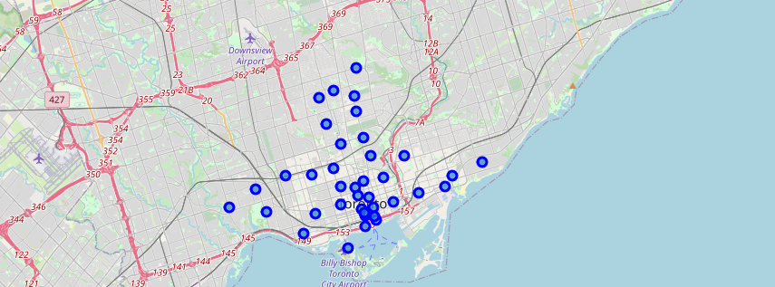
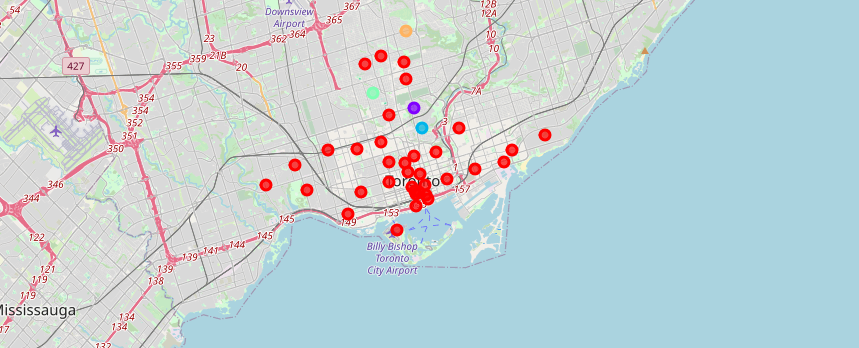

# Segmenting-and-Clustering-Neighborhoods-in-Toronto
In this project, I will explore, segment, and cluster the neighborhoods in the city of Toronto to find out which neighborhoods are similar to each other.

Thi map contains the visualization of the neighbourhoods in Toronto.

This map contains the clusters of neighbourhoods using the *K*-Means ML algorithm.

